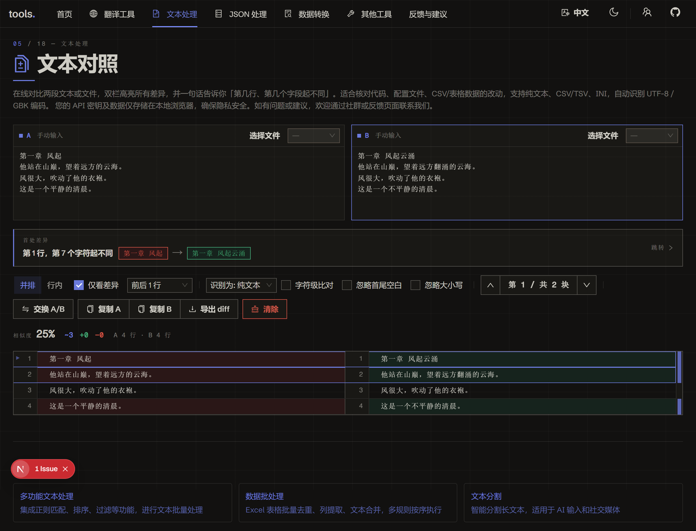

<h1 align="center">
🔍 文本对照
</h1>

    <a href="./README.md">English</a> | 中文

    <em>离线的双栏文本/文件对比工具——高亮所有差异，并一句话告诉你第一处不同在哪</em>

  
  

> 365 开源计划 #016 · 离线双栏文本/文件对比，高亮差异并定位第一处不同

**文本对照** 把两段文本或两个文件并排对比，逐词、逐字符高亮每一处改动，并用一句话告诉你第一处不同在哪——第几行、第几个字段。支持双栏（split）与单栏内联（unified）视图、对 CSV/TSV/INI/JSON 的结构感知对比、忽略空白/大小写选项、用于在差异间跳转的概览标尺，以及一键导出标准 unified-diff `.patch`。工具完全在浏览器本地运行，无服务器、无上传。

👉 **在线体验**：<https://tools.newzone.top/zh/text-diff>

## 核心特性

- **双栏 & 内联视图**：通过 Segmented 选择器在并排双栏与单栏内联（unified）视图间切换
- **首处差异定位**：横幅直接读出第一处改动的位置（第几行/第几个字段），一键跳转
- **逐词、逐字符高亮**：改动行精确高亮发生变化的词/字符片段，而非整行
- **结构感知对比**：自动识别并对齐 CSV、TSV、INI、JSON；其余按纯文本逐行对比（可手动覆盖格式）
- **仅看差异折叠**：折叠未变动的连续行，上下文行数可调（0/1/3/5/10），聚焦真正的改动
- **忽略空白 / 大小写**：一键屏蔽仅由空白或大小写造成的噪声差异
- **概览标尺**：差异区旁的细长标尺把每处改动标成彩色刻度，点击即可跳到对应区块
- **相似度读数**：两侧行数统计 + 行级相似度百分比
- **文件与编码支持**：可拖入文件；自动识别编码（UTF-8、GBK、Big5、UTF-16LE），并支持手动切换
- **导出 `.patch`**：把对比结果导出为标准 unified diff，可直接 `git apply` 或粘进代码审查工具
- **完全本地**：全程在浏览器运行——大文件也不外传，隐私无忧

## 使用方法

1. 在 **A**、**B** 两栏粘贴文本，或把文件拖入任一侧。
2. 看**首处差异横幅**，了解 A、B 从哪里开始不同，点击即可跳转过去。
3. 调整对比方式：
   - 切换 **双栏 / 内联** 视图。
   - 开关 **仅看差异**，并选择保留的 **上下文** 行数。
   - 按需启用 **字符级**、**忽略空白**、**忽略大小写**。
   - 若自动识别有误，手动覆盖 **格式**（纯文本 / CSV / TSV / INI / JSON）。
4. 用上一处/下一处按钮或 **概览标尺** 在改动间导航。
5. **交换** 两侧、**复制** 任一侧，或把对比结果 **导出** 为 `.patch` 文件。

## 对比模式

格式根据文件名与内容自动识别，并可手动覆盖：

- **纯文本** —— 逐行对比（默认兜底）
- **CSV / TSV** —— 按记录对齐行，高亮字段级改动
- **INI** —— 键/值感知
- **JSON** —— 按文本对比（呈现格式差异；并有提示说明这是文本对比而非语义级 JSON diff）

## 性能

对超大输入（单侧约 5000 行以上），O(n×m) 的逐行 diff 会先弹确认，避免页面意外卡死——点击「仍然计算」即可继续。超大输入会跳过字符级高亮，以保持导航流畅。

## 常见问题

**对比的是文本还是文件？** 都可以。在任一栏输入或粘贴，或拖入文件。文件在本地解码并自动识别编码（UTF-8 / GBK / Big5 / UTF-16LE），编码也可手动切换。

**「第一处不同」是怎么定位的？** 引擎找出第一处变动区块，并渲染一条横幅，指明 A、B 从哪一行（结构化格式还会指明字段）开始分歧，附跳转链接——不必通读整份 diff。

**它能理解 JSON / CSV 结构吗？** 会对齐 CSV/TSV 的行、按 INI 的键感知；JSON 按文本对比（呈现格式差异，而非逐键语义比对）——并有明确提示。

**结果能导出吗？** 能——导出标准 unified-diff `.patch`，可粘进 `git apply`、代码审查工具或附到工单。

**会上传内容吗？** 不会。工具完全在浏览器本地运行，无服务器、无上传，大文件也保持私密。

## 文档与部署

详细使用说明与部署指南见 **[官方文档](https://docs.newzone.top/zh/guide/text/text-diff.html)**。

## 关于 365 开源计划

本项目是 [365 开源计划](https://github.com/rockbenben/365opensource) 的第 016 个项目。

一个人 + AI，一年 300+ 个开源项目。[提交你的需求 →](https://my.feishu.cn/share/base/form/shrcnI6y7rrmlSjbzkYXh6sjmzb)

## 贡献

欢迎贡献！随时提交 issue 与 pull request。

## 许可证

MIT © 2025 [rockbenben](https://github.com/rockbenben)。详见 [LICENSE](./LICENSE)。
