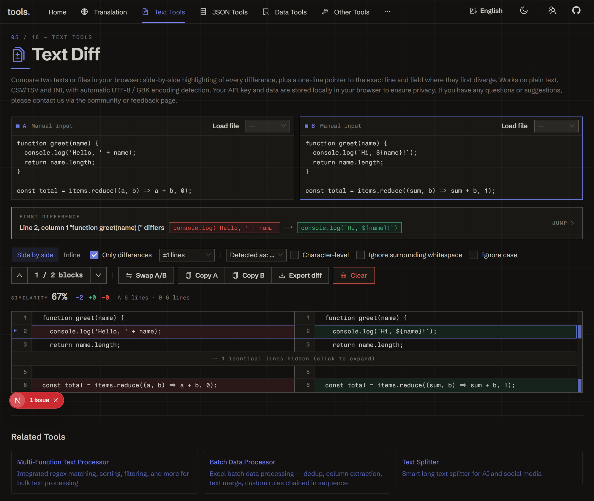

<h1 align="center">
🔍 Text Diff
</h1>

    English | <a href="./README-zh.md">中文</a>

    <em>Offline two-pane text & file comparison — highlight every difference and locate the first one in plain language</em>

  
  

> 365 Open Source Plan #016 · Offline two-pane text & file comparison that highlights every difference and locates the first one

**Text Diff** compares two pieces of text or two files side by side, highlights every change down to the word or character, and tells you in one sentence where the first difference is — which line, which field. It supports split and unified (inline) views, structure-aware comparison for CSV/TSV/INI/JSON, whitespace/case-insensitive options, an overview ruler for jumping between changes, and one-click export to a standard unified-diff `.patch`. Everything runs entirely in your browser — no servers, no uploads.

👉 **Try it online**: <https://tools.newzone.top/en/text-diff>

## Key Features

- **Side-by-Side & Unified Views**: switch between a two-pane split view and a single-column inline (unified) view via a Segmented control
- **First-Difference Locator**: a banner reads out exactly where the first change is (line / field), with a one-click jump to it
- **Word & Character-Level Highlights**: changed lines highlight the precise word/character runs that differ, not just the whole line
- **Structure-Aware Comparison**: auto-detects and aligns CSV, TSV, INI, and JSON; falls back to plain-text line diff otherwise (manual format override available)
- **Diff-Only Folding**: collapse unchanged runs with adjustable context lines (0/1/3/5/10) to focus on what changed
- **Ignore Whitespace / Case**: toggle either to suppress noise-only differences
- **Overview Ruler**: a thin track beside the diff marks every change as a colored tick — click to jump to that hunk
- **Similarity Readout**: per-side line totals plus a line-level similarity percentage
- **File & Encoding Support**: drag in files; encoding auto-detected (UTF-8, GBK, Big5, UTF-16LE) with manual override
- **Export `.patch`**: download the comparison as a standard unified diff, pasteable into `git apply` or review tools
- **Fully Local**: runs entirely in your browser — large files stay private, nothing is uploaded

## How to Use

1. Paste text into the **A** and **B** panes, or drag a file into either side.
2. Read the **first-difference banner** to see where A and B start to diverge, and click it to jump there.
3. Adjust the comparison:
   - Switch **Split / Unified** view.
   - Toggle **Diff only** and pick how many **context** lines to keep.
   - Enable **char-level**, **ignore whitespace**, or **ignore case** as needed.
   - Override the detected **format** (plain / CSV / TSV / INI / JSON) if auto-detection guessed wrong.
4. Navigate changes with the prev/next block buttons or the **overview ruler**.
5. **Swap** the two sides, **Copy** either side, or **Export** the comparison as a `.patch` file.

## Comparison Modes

The format is auto-detected from the file name and content, and can be overridden:

- **Plain text** — line-by-line diff (the default fallback)
- **CSV / TSV** — rows aligned as records; field-level changes highlighted
- **INI** — key/value aware
- **JSON** — compared as text (formatting differences are surfaced; a notice reminds you it's a textual, not semantic, JSON diff)

## Performance

For very large inputs (beyond ~5000 lines per side) the O(n×m) line diff is gated behind a confirmation so the page never freezes unexpectedly — click "compute anyway" to proceed. Char-level highlighting is skipped on oversized inputs to keep navigation responsive.

## FAQ

**What's compared — text or files?** Both. Type or paste into either pane, or drag in a file. Files are decoded locally with encoding auto-detection (UTF-8 / GBK / Big5 / UTF-16LE), and you can override the encoding.

**How is the "first difference" located?** The engine reports the first changed hunk and renders a banner naming the line (and, for structured formats, the field) where A and B diverge, with a jump link — so you don't have to scan the whole diff.

**Does it understand JSON / CSV structure?** It aligns CSV/TSV rows and is INI key-aware. JSON is diffed as text (it surfaces formatting changes, not a semantic key-by-key diff) — a notice makes this explicit.

**Can I export the result?** Yes — export a standard unified-diff `.patch`, which you can paste into `git apply`, code review tools, or attach to a ticket.

**Is anything uploaded?** No. The tool runs entirely in your browser — no servers, no uploads. Even large files stay private.

## Documentation & Deployment

For detailed usage instructions and deployment guides, see the **[Official Documentation](https://docs.newzone.top/en/guide/text/text-diff.html)**.

## About the 365 Open Source Plan

This project is #016 in the [365 Open Source Plan](https://github.com/rockbenben/365opensource).

One person + AI, 300+ open source projects in a year. [Submit your idea →](https://my.feishu.cn/share/base/form/shrcnI6y7rrmlSjbzkYXh6sjmzb)

## Contributing

Contributions are welcome! Feel free to open issues and pull requests.

## License

MIT © 2025 [rockbenben](https://github.com/rockbenben). See [LICENSE](./LICENSE).
